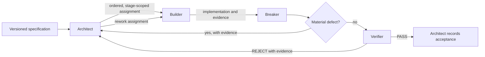

# Phase 2 — Factory architecture

Status: complete on 2026-10-01 (Asia/Calcutta).

This document defines the reusable autonomous software factory required by Phase 2 of the implementation plan. It defines responsibilities, decision rights, lifecycle states, quality gates, and failure boundaries. It does not define the detailed handoff message format, rewrite agent mandates, or implement Pocketful.

## 1. Architectural objective

The factory turns a versioned specification into a stage-scoped, reproducible, independently verified result. It is designed to make incorrect or weakly evidenced work stop at a gate rather than silently advance.

Five invariants govern every run:

1. Factory first: the operating system for delivery is defined before application work begins.
2. Stage isolation: Stage N contains exactly the behavior required through Stage N and remains independently runnable.
3. Separation of duties: no implementation author may provide the final correctness verdict for that implementation.
4. Evidence over assertion: a claim is not accepted without reproducible commands, outputs, and a commit identity.
5. Reusable roles: seat behavior is domain-neutral; challenge-specific facts travel in tasks and evidence, not in mandates.

## 2. Four-seat topology

The plan's recommended seats map to the repository's current names as follows:

- Architect is the Coordinator / Architect.
- Builder is the Implementer.
- Breaker is the Adversarial QA Agent.
- Verifier is the Verifier / Auditor.

This is a control flow, not a Phase 3 handoff template. Detailed message fields and response formats remain deliberately deferred.

## 3. Decision rights and role boundaries

### 3.1 Architect

The Architect owns orchestration, not routine implementation.

It must:

- read the complete specification set and maintain the requirements breakdown;
- define stage scope and prevent later-stage behavior from leaking into earlier folders;
- order tasks by dependency and assign each task with enough context to execute independently;
- track task state, unresolved risks, and dependencies;
- route defects and verification failures back as explicit rework;
- record stage acceptance only after the Verifier has issued PASS.

It must not:

- become the default application coder;
- waive required evidence;
- override a Verifier REJECT;
- declare acceptance while material Breaker findings remain unresolved;
- silently change requirements to make an implementation pass.

### 3.2 Builder

The Builder owns the assigned implementation surface.

It must:

- implement only explicitly assigned, stage-scoped requirements;
- create or update source, tests, `Dockerfile`, and `RUN.md` as the task requires;
- preserve behavior inherited from earlier stages;
- commit a coherent change and identify its exact commit;
- report what changed and why;
- disclose assumptions, limitations, validation commands, and results.

It must not:

- introduce unassigned later-stage behavior;
- alter the specification, official harness, or independent evidence to obtain a pass;
- certify its own work as finally correct;
- absorb the Breaker or Verifier role for the same change.

### 3.3 Breaker

The Breaker owns adversarial discovery and remains independent of implementation.

It must:

- derive attack cases independently from the specification and current stage boundary;
- probe ambiguity, malformed inputs, boundary values, state transitions, and incomplete validation;
- target concurrency, ordering, restart, persistence, and failure behavior when relevant;
- test beyond the public happy path and distinguish product defects from test defects;
- return reproducible findings with severity, preconditions, actions, expected behavior, and observed behavior.

It must not:

- optimize for confirming the Builder's claims;
- repair the implementation it is judging;
- suppress a material finding because public checks pass;
- issue the final acceptance verdict.

### 3.4 Verifier

The Verifier is the independent acceptance gate.

It must:

- evaluate the exact candidate commit, not an uncommitted working tree;
- build the stage image and run the service under judge-like restricted conditions;
- run the official harness and relevant independent checks;
- verify that `RUN.md` reproduces the build and run procedure;
- check the current stage boundary and regression behavior from all earlier stages;
- assess Builder evidence and Breaker findings without relying on either party's conclusion;
- issue PASS only when all required evidence is sufficient, otherwise issue REJECT with reproducible reasons.

It must not:

- modify application code or implementation tests while acting as Verifier;
- treat an unverified claim as evidence;
- downgrade a failed required check into a warning;
- approve a different revision from the one it tested.

## 4. Authority model

Verification and acceptance are intentionally separate decisions:

- The Verifier has exclusive authority to issue the technical PASS or REJECT verdict for a candidate revision.
- The Architect has authority to record a stage as accepted, but only when the exact revision has a Verifier PASS, no unresolved material Breaker finding, and all stage prerequisites are satisfied.
- A REJECT is binding. The Architect must create rework or re-plan; it cannot override the verdict.
- The Builder can report completion, but that report changes the task to reviewable—not accepted.
- The Breaker can block progression by producing a reproducible material defect, but only the Verifier closes the technical gate after repair.
- The human project owner retains ultimate authority to change scope or the factory design. Such a change must be explicit and recorded; agents cannot infer it from convenience.

This resolves the plan's two complementary statements: the Verifier is the acceptance gate, while the Architect decides when the stage can be recorded as accepted.

## 5. Work lifecycle

Every unit of work moves through a controlled state machine:

1. `PLANNED`: the Architect has identified a bounded requirement group and its dependencies.
2. `ASSIGNED`: one Builder owns the implementation task and its target stage.
3. `IMPLEMENTED`: a candidate commit and Builder evidence exist.
4. `ATTACKED`: the Breaker has completed adversarial review against that commit.
5. `VERIFYING`: the Verifier is testing the same immutable candidate revision.
6. `REWORK_REQUIRED`: a material finding or failed gate returns control to the Architect for a new assignment.
7. `VERIFIED`: the Verifier has issued PASS for the exact revision.
8. `ACCEPTED`: the Architect has confirmed prerequisites and recorded the stage decision.

Only these transitions are valid:

- `PLANNED → ASSIGNED → IMPLEMENTED → ATTACKED → VERIFYING → VERIFIED → ACCEPTED`
- `ATTACKED → REWORK_REQUIRED → ASSIGNED`
- `VERIFYING → REWORK_REQUIRED → ASSIGNED`

A repaired commit is a new candidate. Previous Breaker and Verifier conclusions do not automatically transfer to it.

## 6. Stage and dependency control

The Architect maintains one active stage boundary and treats earlier behavior as a regression contract.

- Work is decomposed into coherent requirement groups small enough to implement and review independently.
- Every task identifies the target stage and the earlier-stage behavior it must preserve.
- Stage N cannot be accepted before every earlier stage is accepted.
- A later-stage suite passing cannot compensate for an earlier-stage regression.
- Each stage owns its source, `Dockerfile`, and `RUN.md`; a final implementation must not be copied backward to simulate stage completeness.
- Ambiguous scope is resolved before assignment. Agents must not guess across stage boundaries.

## 7. Evidence architecture

The factory uses Git and reproducible runtime evidence as its audit spine.

Each candidate must be traceable through:

- the specification revision and requirement identifiers used by the Architect;
- the task identity and target stage;
- the Builder's immutable commit hash and self-check results;
- the Breaker's independent findings or explicit no-material-finding result;
- the Verifier's tested commit, commands, environment, results, and verdict;
- the Architect's final acceptance or rework decision.

Evidence must be sufficient for another developer to reproduce the result from a clean checkout. Room history is collaboration evidence, not a substitute for repository artifacts or executable checks.

The shared Git policy remains:

- `origin/main` is the common source of truth;
- agents synchronize before starting and before publishing;
- commits contain only owned or assigned files;
- no force-push, history rewriting, credential commits, or speculative conflict resolution;
- ambiguous conflicts stop the affected task until ownership is clarified.

## 8. Gate model

The architecture uses three independent gates before acceptance.

### Gate A — Builder readiness

The candidate is reviewable only when its scoped implementation, relevant tests, container instructions, assumptions, and exact commit are present. This gate is a readiness claim, not certification.

### Gate B — Breaker review

The candidate can progress only when adversarial review has either produced no material unresolved finding or the identified defects have been repaired in a new candidate.

### Gate C — Verifier acceptance

PASS requires all applicable evidence to agree:

- clean build from the candidate commit;
- container starts and exposes the required interface;
- health and reset contracts work where required;
- official harness checks for the claimed stage pass;
- earlier-stage suites still pass;
- later-stage behavior has not leaked into the stage;
- runtime restrictions, including offline behavior, are satisfied;
- `RUN.md` is accurate and reproducible;
- material Breaker findings are closed.

Missing, stale, contradictory, or non-reproducible evidence produces REJECT.

## 9. Failure handling

Failures are routed according to ownership:

- Requirement ambiguity returns to the Architect before implementation continues.
- Implementation or test failure returns to the Architect, which assigns Builder rework.
- Adversarial findings remain open until the Verifier confirms the repaired revision.
- Environment or harness failure is recorded separately from product failure and reproduced before assigning code changes.
- Git conflicts stop publication; agents do not guess which collaborator's work should win.
- Tool or agent unavailability pauses only the affected transition. It does not authorize another role to self-approve.

Repeated repair loops should cause the Architect to reduce task size, revisit assumptions, or revise ordering rather than repeatedly issuing the same vague assignment.

## 10. Quality attributes

The design prioritizes:

- Independence: implementation, attack, and acceptance are separate responsibilities.
- Determinism: candidates are identified by commit and evaluated with repeatable commands.
- Traceability: every accepted behavior maps back to a requirement and evidence chain.
- Containment: stage boundaries and role permissions limit the blast radius of mistakes.
- Recoverability: rejection returns to a defined owner and never destroys prior accepted history.
- Portability: generic roles and Git-based artifacts allow different agent harnesses or models to collaborate.
- Auditability: acceptance decisions can be reconstructed without relying on memory or private chat context.

## 11. Risks and architectural controls

- Architect bottleneck: keep tasks small, ordered, and independently actionable; avoid routing routine coding through the Architect.
- Builder tunnel vision: require independent Breaker analysis and prevent self-certification.
- Breaker confirmation bias: derive attack cases from the specification before relying on Builder notes.
- Verifier drift: test an exact commit with standard commands and record the environment.
- Stage overshoot: make target stage explicit and probe for later-stage behavior.
- Regression: rerun all inherited suites, not only the newest suite.
- Shared-repository races: synchronize around each work item and stop on ambiguous conflicts.
- Evidence loss: store durable reports in the repository and preserve the exported room record for the later submission phase.

## 12. Phase boundaries

Phase 2 ends with this architecture and does not cross into later work:

- Phase 3 will define the exact handoff, rejection, rework, and evidence-message formats.
- Phase 4 will encode the approved architecture and Phase 3 protocol into final reusable mandate files.
- Later phases will build the automation and Pocketful stages.

The repository already contains mandate files created during initial agent setup. They are treated as provisional deployment artifacts. They were not modified in Phase 2 and must be reconciled with this architecture during the plan's mandate-authoring phase.

## 13. Completion record

Phase 2 is complete because:

- all four recommended seats are mapped to the active agent names;
- responsibilities and prohibited actions are explicit;
- implementation, adversarial review, and acceptance are independent;
- PASS, REJECT, rework, and final stage-acceptance authority are unambiguous;
- the stage lifecycle and allowed transitions are defined;
- stage isolation, dependency control, evidence, and failure handling are defined;
- Phase 3 and Phase 4 concerns remain explicitly deferred;
- no Pocketful implementation or mandate rewrite was performed.
